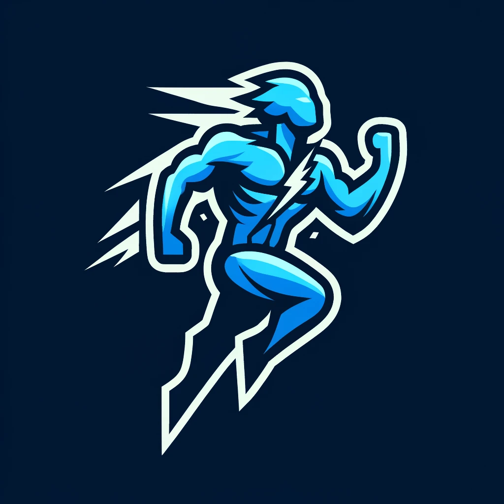

# SmartLift


Empower Your Fitness Journey with AI-Driven Insights and Personalization.

## How to Run

### Repository Cloning

Clone the repository and navigate to the project directory:
```bash
git clone <repository-url>
cd <repository-name>
```

### API Setup

1. Navigate to the `src` directory:
   ```bash
   cd src
   ```

2. Install the required Python dependencies:
   ```bash
   pip install -r requirements.txt
   ```

3. Create a `.env` file inside the `src` folder and add the `GOOGLE_API_KEY` that allows to use Gemini models:
   ```plaintext
   GOOGLE_API_KEY=<your_google_api_key>
   ```
   Obtain an API key from [Google AI Studio](https://aistudio.google.com/app/apikey).

   If Google AI Studio is not available in your region, check the [available regions](https://ai.google.dev/gemini-api/docs/available-regions) and consider using a VPN.

4. Start the backend server:
   ```bash
   uvicorn app.main:app --reload
   ```

### Web App Setup

1. Navigate to the `webapp` directory:
   ```bash
   cd ../webapp
   ```
   Assuming you were in the `src` directory.

2. Install the required Node.js dependencies:
   ```bash
   npm install
   ```

3. Create a `.env` file inside the `webapp` folder and set the `VITE_BACKEND_URL` that will maintain the base URL of the backend. Exemple:
   ```plaintext
   VITE_BACKEND_URL=http://127.0.0.1:8000
   ```

4. Start the frontend application:
   ```bash
   npm run dev
   ```

## Project Structure

```
.
├── src                     # Backend source files
│   ├── app                 # FastAPI application
│   │   ├── routers         # API routes
│   │   └── services_to_be_reordered # Services for video and frame analysis
│   └── venv                # Python virtual environment
└── webapp                  # Frontend source files
    ├── public              # Static files like favicon
    └── src                 # Vue.js project files
        ├── api             # API service calls
        ├── assets          # Static assets like images and styles
        ├── components      # Vue components
        └── router          # Vue router
```

## Project Description

### Inspiration

My boyfriend and I are **passionate** about **sports/fitness** and **AI/GenAI** technologies. We decided to **combine** our interests to create something innovative and impactful in the fitness space using the latest advancements in GenAI.

### What It Does

**SmartLift** offers a fully developed unique feature as an **MVP**. Users can upload their workout videos to receive instant feedback on their form, helping to enhance workout effectiveness and prevent injuries.

### How We Built It

We used **Vue.js** (Vuetify + Axios) for the frontend and **Python** for the backend, incorporating **Gemini 1.5 Pro** via **Google AI Studio**. The backend and frontend are connected via **FastAPI**. Version control was handled with **Git**, and project management was conducted using a **Kanban** board in an agile manner.

### Challenges We Ran Into

- Handling **video data** formats.
- Developing a **consistent brand identity**.
- **Time management**, as development began on April 21st.

### Accomplishments That We're Proud Of

- Developed a **comprehensive web app from scratch**.
- Integrated the **latest AI technology** using Gemini 1.5 Pro.
- Balanced this project with our work and personal commitments.
- Achieved a responsive web app design.

### What We Learned

- How the **Google GenAI API** works.
- Efficient handling of **video upload inputs** from the UI to the backend service.

### What's Next for SmartLift

- **Workout Planner**: Tailored workout plans based on user goals.
- **Virtual Coach**: 24/7 AI coach for fitness advice.
- **Progress Tracker**: Document and analyze your fitness journey.
- **Meal Scanner**: Instant nutritional information from meal photos.
- **Diet Designer**: Customized meal plans based on dietary needs.

## License

This project is licensed under the [Apache License 2.0](LICENSE).